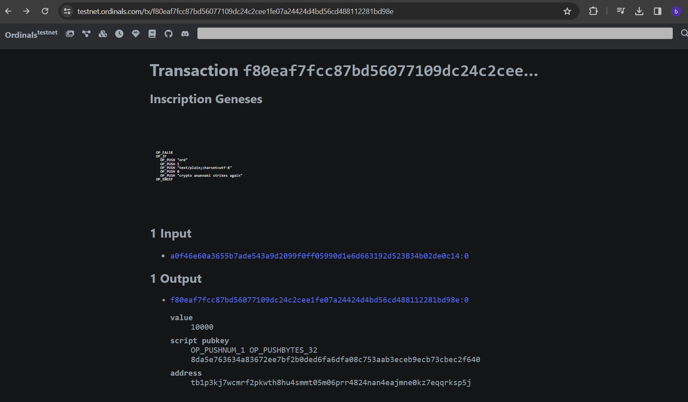

 In this readme are cli commands to interact with the bitcoind and ord libraries to create inscriptions on both the testnet and regnet. 

In this repo are scripts included are to demonstrate interacting with the bitcoin-cli interface via js. 

---
**TO RUN ORD WALLET CLOSE THE ORD SERVER, IT NEEDS TO SELF INDEX**
---

----- START TESTNET ------

1) .\bitcoind in -testnet using the d drive to store the blockchain

    .\bitcoind -testnet -datadir="D:\BitcoinData" -txindex

2) check with .\bitcoin-cli that testnet is synced compare block number to [bitcoin testnet](https://mempool.space/testnet) 

    .\bitcoin-cli --testnet --datadir="D:\BitcoinData" getblockchaininfo

3) check block count

    .\bitcoin-cli --testnet --datadir="D:\BitcoinData" getblockcount

    can check block against the [ordinals.com testnet](https://testnet.ordinals.com/blocks) 

5) list wallets

    .\bitcoin-cli --testnet --datadir="D:\BitcoinData" listwallets

6) create taproot wallet

    .\bitcoin-cli --testnet --datadir="D:\BitcoinData" createwallet "ord" false false "" false true

7) get wallet recieve address

    .\bitcoin-cli --testnet --datadir="D:\BitcoinData" -rpcwallet="taproot_wallet1" getnewaddress "" "bech32m"

    e.g. tb1pk0vfpp7jf6cv0j926gqr2d39uy292y9l5yc904p7vcq5jthktjrscz24vf

8) list descriptors

    .\bitcoin-cli --testnet --datadir="D:\BitcoinData" listdescriptors

9) start the ord server with the testnet

    ord --testnet --bitcoin-data-dir="D:\BitcoinData" --cookie-file="D:\BitcoinData\testnet3\.cookie" server --http-port 8080 --address 127.0.0.1

10) create ord wallet

    ord --testnet --bitcoin-data-dir="D:\BitcoinData" --cookie-file="D:\BitcoinData\testnet3\.cookie" wallet create

11) create ord wallet recieve 

    ord --testnet --bitcoin-data-dir="D:\BitcoinData" --cookie-file="D:\BitcoinData\testnet3\.cookie" wallet receive

12) load wallet named "ord"

    .\bitcoin-cli -testnet -datadir="D:\BitcoinData" loadwallet "ord"

13) unload wallet named "ord"

    .\bitcoin-cli -testnet -datadir="D:\BitcoinData" unloadwallet "ord"

14) get addresses 

    .\bitcoin-cli -testnet -datadir="D:\BitcoinData" listaddressgroupings

15) get balance

   
    .\bitcoin-cli -testnet -datadir="D:\BitcoinData" getreceivedbyaddress "tb1pk0vfpp7jf6cv0j926gqr2d39uy292y9l5yc904p7vcq5jthktjrscz24vf"

16) get balance ord

    ord --testnet --bitcoin-data-dir="D:\BitcoinData" --cookie-file="D:\BitcoinData\testnet3\.cookie" wallet balance

17) inscribe a text saved in a .txt 

    ord --testnet --bitcoin-data-dir="D:\\BitcoinData" --cookie-file="D:\\BitcoinData\\testnet3\\.cookie" wallet inscribe --fee-rate 10 --file "C:\\Users\\bengs\\Bitcoin_Projects\\ord\\inscribed.txt"

    inscribe an image

    ord --testnet --bitcoin-data-dir="D:\\BitcoinData" --cookie-file="D:\\BitcoinData\\testnet3\\.cookie" wallet inscribe --fee-rate 10 --file "C:\\Users\\bengs\\Bitcoin_Projects\\ord\\radbro.jpg"

97) get testnet bitcoin

    use this [swap](https://www.altquick.com/swap/)

    

98) to open testnet gui  // need to close bitcoind first as it has a lock and will lock

    
    ./bitcoin-qt -testnet -datadir="D:\BitcoinData" -wallet=ord

99) STOP TESTNET

    .\bitcoin-cli --testnet --datadir="D:\BitcoinData" stop

     ord --testnet --bitcoin-data-dir="D:\\BitcoinData" --cookie-file="D:\\BitcoinData\\testnet3\\.cookie" --index-runes="C:\\Users\\bengs\\AppData\\Roaming\\ord\\testnet3\\index.redb" runes

---

**runes**

---

need to reindex runes by first deleting the original .redb file and runnig the index run or the index update command

100) index runes

    ord --index-runes  --testnet --bitcoin-data-dir="D:\\BitcoinData" --cookie-file="D:\\BitcoinData\\testnet3\\.cookie"  index update

101) index info

    ord --index-runes  --testnet --bitcoin-data-dir="D:\\BitcoinData" --cookie-file="D:\\BitcoinData\\testnet3\\.cookie" index info

102) etch // not correct yet

    ord --index-runes  --testnet --bitcoin-data-dir="D:\\BitcoinData" --cookie-file="D:\\BitcoinData\\testnet3\\.cookie"  wallet etch --divisibility 0 --fee-rate 1 --rune AAAAAAAAAAAAAAAAA --supply 100 --symbol z

103)  get runes

     ord --testnet --bitcoin-data-dir="D:\\BitcoinData" --cookie-file="D:\\BitcoinData\\testnet3\\.cookie" --index-runes runes

---

---

---REGTEST---

1) start regtest
   
    .\bitcoind -regtest -datadir="D:\BitcoinRegtest" -txindex -listen=0

1) get info 

     .\bitcoin-cli --regtest -datadir="D:\BitcoinRegtest" getblockchaininfo

1) create ord wallet on regtest

    ord --regtest --bitcoin-data-dir="D:\BitcoinRegtest" --cookie-file="D:\BitcoinRegtest\regtest\.cookie" wallet create

1) recieve ord wallet on regtest

    ord --regtest --bitcoin-data-dir="D:\BitcoinRegtest" --cookie-file="D:\BitcoinRegtest\regtest\.cookie" wallet receive
    
    e.g. "bcrt1pj5c2dlkspvkcj2nq7amv0r2sqxw4vtjtrxhlf3c6mqkyaa7452vsa9xjn2"

1) generate to address (needs to be more than 101 for first rewards)

    .\bitcoin-cli -regtest -datadir="D:\BitcoinRegtest" generatetoaddress 101 'bcrt1pj5c2dlkspvkcj2nq7amv0r2sqxw4vtjtrxhlf3c6mqkyaa7452vsa9xjn2'

    1) if ord and bitcoind are not in sync then

        - Navigate to:

            "C:\Users**{USERNAME}**\AppData\Roaming\ord" and delete the regtest folder

        - Now go to the cmd and then run the following commands:

            ord -r index run

1) get balance of address

    .\bitcoin-cli -regtest -datadir="D:\BitcoinRegtest" getbalance

1) index ord

    ord --regtest --bitcoin-data-dir="D:\BitcoinRegtest" --cookie-file="D:\BitcoinRegtest\regtest\.cookie" index update

1) get balance ord

    ord --regtest --bitcoin-data-dir="D:\BitcoinRegtest" --cookie-file="D:\BitcoinRegtest\regtest\.cookie" wallet balance
    

1) inscribe a text saved in a .txt 

    ord --regtest --bitcoin-data-dir="D:\BitcoinRegtest" --cookie-file="D:\BitcoinRegtest\regtest\.cookie" wallet inscribe --fee-rate 10 --file "C:\\Users\\bengs\\Bitcoin_Projects\\ord\\inscribed.txt"

1) inscribe a jpg file

    ord --regtest --bitcoin-data-dir="D:\BitcoinRegtest" --cookie-file="D:\BitcoinRegtest\regtest\.cookie" wallet inscribe --fee-rate 10 --file "C:\\Users\\bengs\\Bitcoin_Projects\\ord\\radbro.jpg"

1) start the ord server with the regtest

    ord --regtest --bitcoin-data-dir="D:\BitcoinRegtest" --cookie-file="D:\BitcoinRegtest\regtest\.cookie" server --http-port 8080 --address 127.0.0.1

1) stop regtest
    
    .\bitcoin-cli -regtest -datadir="D:\BitcoinRegtest" stop
    
---

---

**Example Inscription for text**

file: 
inscribed.txt:

    OP_FALSE
    OP_IF
    OP_PUSH "ord"
    OP_PUSH 1
    OP_PUSH "text/plain;charset=utf-8"
    OP_PUSH 0
    OP_PUSH "some text to inscribe"
    OP_ENDIF

**Example Inscription for Text/ Image on RegTest**

---

---

To estimate fees: 

    divide the content size by four and multiply by the fee rate.